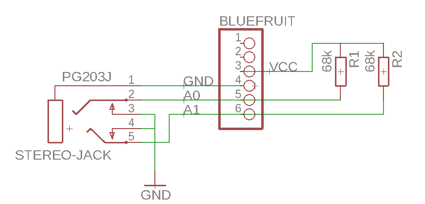

# BBQ Thermometer

## Hardware

### Board ([nrf52](https://www.adafruit.com/product/3406))

* [Arduino IDE Setup](https://learn.adafruit.com/bluefruit-nrf52-feather-learning-guide/arduino-bsp-setup)
* [pinout](https://learn.adafruit.com/bluefruit-nrf52-feather-learning-guide/device-pinout)
* [library](https://github.com/adafruit/Adafruit_nRF52_Arduino/)

### Probes

Some NTCs from Senstech (lets use pt1000 next time...) with a stero jack

## Frontend

Let's write an awesome PWA with web bluetooth

### Web Bluetooth API

chrome://flags/#enable-experimental-web-platform-features

* [inspiration](https://www.youtube.com/watch?v=_4nrh6mTt4E&feature=youtu.be&t=8h19m47s)
* bluetooth terminal ([app](https://github.com/1oginov/Web-Bluetooth-Terminal), [library](https://github.com/1oginov/bluetooth-terminal))
* [samples](https://googlechrome.github.io/samples/web-bluetooth/) ([source](https://github.com/GoogleChrome/samples/tree/gh-pages/web-bluetooth))
* [gatt](https://www.bluetooth.com/specifications/gatt/services), [defines](https://github.com/adafruit/Adafruit_nRF52_Arduino/blob/master/libraries/Bluefruit52Lib/src/BLEUuid.h)
  * Services
    * [Environmental Sensing](https://www.bluetooth.com/specifications/gatt/viewer?attributeXmlFile=org.bluetooth.service.environmental_sensing.xml)  0x181A
  * Characteristics
    * [Temperature](https://www.bluetooth.com/specifications/gatt/viewer?attributeXmlFile=.bluetooth.characteristic.temperature.xml) 0x2A1E, 0x2A1F
    * [Measurement Interval](https://www.bluetooth.com/specifications/gatt/viewer?attributeXmlFile=org.bluetooth.characteristic.measurement_interval.xml) 0x2A21
